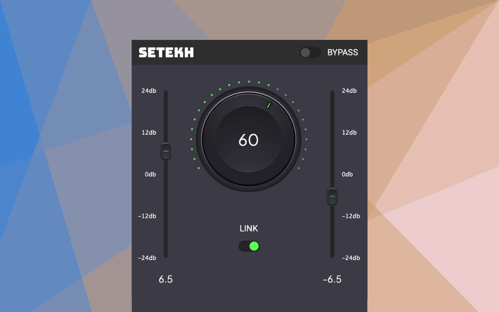

# Setekh

A minimalistic yet sonically powerful distortion plugin created and distributed via Full FX Media.

This is a C++ audio plugin project utilizing the JUCE framework. The build system is CMake. Licensed under GPL.

See [Full FX Media](https://fullfxmedia.com/) for more information and plugins.

## About

[Setekh](<https://en.wikipedia.org/wiki/Set_(deity)>) is a god of deserts, storms, disorder, violence, and foreigners in ancient Egyptian religion.



## Downloads

Prebuilt binaries are available for Windows, macOS, and Linux.  

Each release includes platform-specific zip files. Extract the zip file to a directory of your choice, and you will find the plugin files ready for use in your DAW:

- [Latest Release](https://github.com/fullfxmedia/setekh/releases/latest)

## Building from Source

```bash
git clone --recurse-submodules https://github.com/tiagolr/ripplerx.git

# OSX
cmake -G "Unix Makefiles" -DCMAKE_BUILD_TYPE=Release -DCMAKE_OSX_ARCHITECTURES="x86_64;arm64" -S . -B ./build
cmake --build ./build --config Release
```

Clean target:

```bash
cmake --build ./build --target clean --config Release
```

Refresh BinaryData/resources folder:
```bash
cd build
cmake ..
make clean
make
```

---

# Key Files

- `CMakeLists.txt`: The main CMake build configuration file.
- `src/PluginProcessor.h` & `src/PluginProcessor.cpp`: Core audio processing logic.
- `src/PluginEditor.h` & `src/PluginEditor.cpp`: Plugin UI implementation.
- `src/CustomKnobLNF.h` & `src/CustomSliderLNF.h`: Custom "Look and Feel" classes for UI elements, indicating a convention for custom styling.
- `.github/workflows/build.yml`: Defines the CI build process, a good reference for build commands.

# How to Build

The project uses CMake. The standard build process is likely:

1.  **Configure:** `cmake -B build`
2.  **Build:** `cmake --build build`

The `make.sh` script is also present and may provide a simplified build method. I will inspect it before using it. For the canonical build process, I will refer to `.github/workflows/build.yml`.

# Code Style and Conventions

The code appears to follow standard JUCE/C++ conventions. UI components seem to be styled using custom LookAndFeel (`LNF`) classes, and I will follow this pattern for any new UI work.

# License

This project is licensed under the GNU General Public License v3.0. See [LICENSE](LICENSE).

### Third-Party Components

- **JUCE**: JUCE framework is licensed under the GNU GPL v3. See [JUCE License](https://juce.com/legal/juce-6-licence) for more information.
- **Roboto Font**: Copyright © Google. Licensed under the [Apache License, Version 2.0](https://www.apache.org/licenses/LICENSE-2.0). See the [Roboto font repository](https://github.com/googlefonts/roboto) for more information.
- **Bungee Font**: Copyright © 2023, Bungee. Licensed under the [SIL Open Font License, Version 1.1](https://scripts.sil.org/cms/scripts/page.php?site_id=nrsi&id=OFL_web). See the [Bungee font repository](https://github.com/google/fonts/tree/main/ofl/bungee)
- **PlusJakartaSans Font**: Copyright © 2023, PlusJakartaSans. Licensed under the [SIL Open Font License, Version 1.1](https://scripts.sil.org/cms/scripts/page.php?site_id=nrsi&id=OFL_web). See the [PlusJakartaSans font repository](https://github.com/google/fonts/tree/main/ofl/plusjakartasans)


